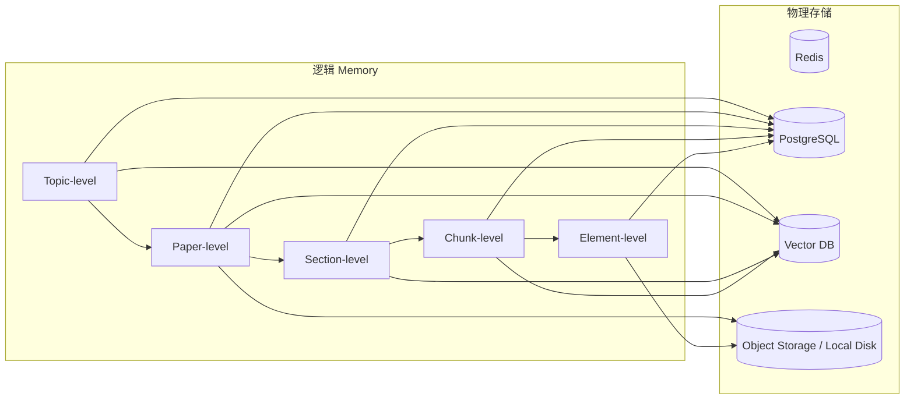
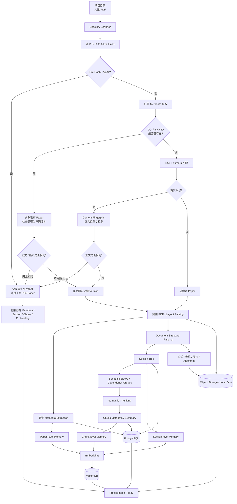
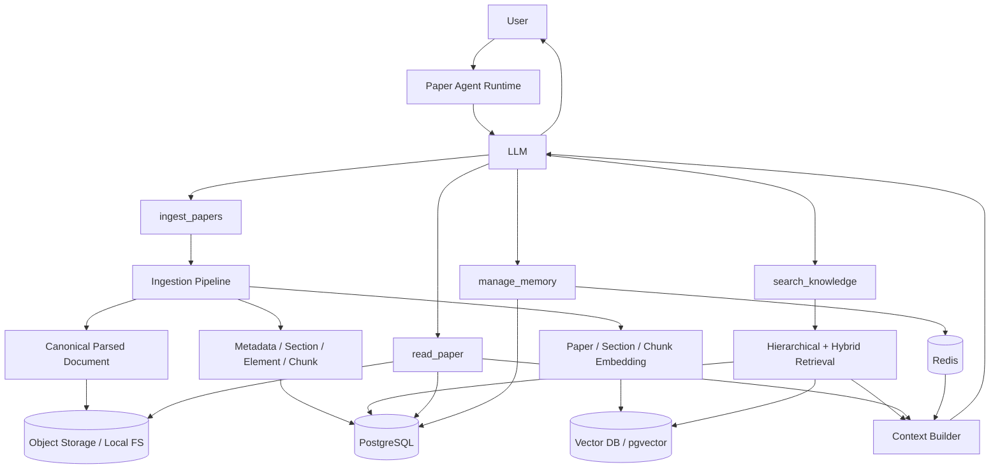
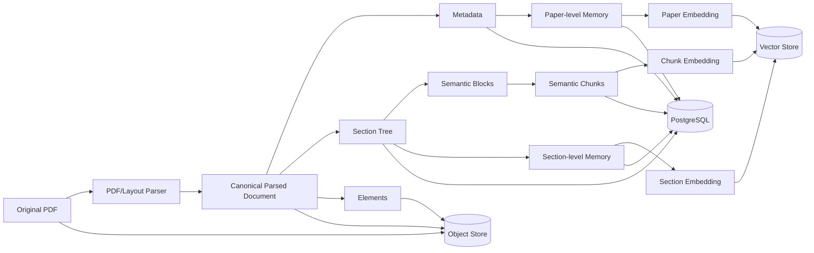

# Paper Agent 技术设计文档

> 面向本地项目目录中的大规模论文管理、解析、检索、阅读、问答与长期记忆的 Agent 系统设计  
> 目标读者：使用 Codex / LLM 辅助实现本项目的开发者  
> 推荐语言：Python  
> 文档性质：Architecture + Technical Specification + Implementation Guide

---

# 1. 项目目标

Paper Agent 的目标不是把大量论文“放进模型上下文”，而是在一个项目目录中维护一个可持续增长、可增量更新、可追溯、低噪音检索的论文知识系统。

典型场景：

- 一个项目目录下包含 1000～10000 篇 PDF。
- Agent 第一次进入项目时，需要执行初始化和索引。
- 后续重新启动时，只处理新增、删除或修改过的论文。
- 用户可以直接询问某篇论文。
- 用户也可以只记得论文的大概标题、简称，甚至只记得论文内容。
- 用户可以比较多篇论文。
- 用户可以询问 Method、公式、Table、Figure、Algorithm、实验结果等细粒度问题。
- Agent 要保存用户的论文阅读历史、提问记录、比较记录、笔记和长期偏好。
- 大规模论文存在时，检索结果必须尽量低噪音，避免无关 Chunk 干扰 LLM 决策。

核心思想：

```text
LLM 不直接保存 1000 篇论文
        ↓
论文持久化为外部 Memory
        ↓
Query 到来时定位 Topic / Paper / Section / Chunk
        ↓
只检索少量高质量 Evidence
        ↓
Context Builder 过滤与组装
        ↓
LLM 阅读、推理并回答
```

核心原则：

> **LLM 负责理解、决策、推理和生成；确定性的解析、去重、索引、检索、持久化由程序完成。**

---

# 2. Agent、LLM、Tool、Memory 的职责边界

## 2.1 Agent ≠ LLM

Paper Agent 应理解为：

```text
Paper Agent
│
├── Agent Runtime / Agent Loop
├── LLM
├── Tools
├── Memory Manager
├── Retrieval System
├── Context Builder
└── State
```

职责：

### LLM
负责：

- 理解用户 Query
- 判断用户意图
- 判断是否需要调用 Tool
- 决定调用哪个 Tool
- 生成 Tool 参数
- 阅读 Tool Result
- 综合证据
- 推理
- 生成最终回答

### Agent Runtime
负责：

- Agent Loop
- Tool 调用
- Tool Result 回传
- Session State
- Error Handling
- Context Assembly
- Tool Registry

### Tool
负责：

- 提供高层业务能力
- 屏蔽内部复杂实现

### Memory
负责：

- 论文知识
- 用户历史
- Session 状态
- 长期交互记录
- 阅读笔记

### Context Builder
负责：

- 选择真正进入 LLM Context 的信息
- 控制 Token Budget
- 去重
- 控制证据平衡
- 过滤低相关 Evidence

---

## 2.2 Agent Loop

典型流程：

```text
用户
 ↓
Agent Runtime
 ↓
LLM
 ↓
LLM 判断是否需要 Tool
 ↓
Tool Call
 ↓
Agent Runtime 执行 Tool
 ↓
Tool Result
 ↓
重新给 LLM
 ↓
LLM 判断是否还需 Tool
 ↓
最终回答
```

因此，不能简单理解成：

```text
Agent 整理信息 → LLM
```

更准确的是：

```text
LLM
 ↕
Agent Runtime
 ↕
Tools
```

循环交互。

---

# 3. Tool 设计原则

Tool 宜少不宜多。

不建议把这些内部模块直接暴露给 LLM：

```text
pdf_parser
layout_parser
metadata_extractor
section_tree_builder
semantic_chunker
embedding_generator
vector_writer
bm25_retriever
reranker
postgres_writer
```

这些是内部 Pipeline / Service。

推荐第一版只暴露 4 个 Tool：

```text
ingest_papers; 将本地 PDF、目录或论文来源加入当前项目并完成索引。内部自动执行扫描、Hash 去重、版本检测、PDF Parsing、Metadata 提取、Section Tree 恢复、Semantic Chunking、Paper/Section Memory 构建、Embedding 和数据库写入；只处理新增或发生变化的论文。

search_knowledge; 在当前项目论文知识库中检索相关论文和证据。内部自动完成 Query 范围分析、Metadata Filter、Topic/Paper/Section/Chunk 分层检索、BM25 + Vector 混合召回、Reranking、去重、Threshold 和证据过滤，返回少量高质量 Evidence 及 paper_id、section、page 等来源信息。

read_paper; 精确读取指定论文中的原始或结构化内容。当 search_knowledge 已定位论文或位置后，用于读取完整 Section、指定 Page、Figure、Table、Equation、Algorithm 或其上下文。

manage_memory; 管理用户与论文交互产生的长期记忆，包括保存和检索论文阅读笔记、历史提问、论文比较记录、用户标注及重要研究结论，使 Agent 能理解“之前那篇论文”“上次比较的方法”等历史指代。
```

如果 Memory 保存由 Runtime 自动完成，Tool 甚至可以进一步压缩成：

```text
ingest_papers
search_knowledge
read_paper
```

核心原则：

> **复杂性应该封装在 Tool 内部，而不是让 LLM 微操每个 Pipeline 步骤。**

---

# 4. Memory 总体设计

Memory 需要从两个维度理解：

1. 记忆性质
2. 知识粒度

这两套分类不要混淆。

---

# 5. 按记忆性质分类

## 5.1 Working Memory

真正处于 LLM 当前 Context Window 中的信息：

- System Prompt
- 当前 User Query
- 少量最近对话
- 当前 Tool Result
- 当前检索 Evidence
- 当前 Task State 摘要

Working Memory 不等于 Redis。

---

## 5.2 Short-Term Memory

用于维护当前 Session / Task：

```text
当前对话
当前论文
当前 Topic
Agent 当前状态
Tool Result
最近检索结果
临时总结
```

推荐：

```text
Redis
```

Redis 更准确的角色：

```text
Session Store
State Store
Short-Term Memory Store
```

---

## 5.3 Long-Term Semantic Memory

保存“论文里有什么”。

例如：

```text
论文摘要
研究问题
Method
Section
Chunk
Equation
Figure
Table
实验结论
```

推荐组合：

```text
PostgreSQL
+
Vector DB
+
Object Storage / Local FS
```

不能简单理解成：

```text
长期记忆 = Vector DB
```

Vector DB 更接近：

```text
Semantic Index
```

---

## 5.4 Episodic Memory

保存：

> 用户与 Agent 发生过什么。

例如：

```text
用户曾问过 SCANet 的 codebook
用户曾比较 HERO 和 SCANet
用户昨天研究了 CG-DETR 的 CCL
```

推荐：

```text
PostgreSQL
+
可选 Vector Index
```

---

## 5.5 Procedural Memory

保存：

- Agent 工作规则
- Prompt
- 项目配置
- 用户工作流偏好
- Parser 配置
- Chunk 配置
- Embedding 配置

推荐：

```text
config file
PostgreSQL
KV
```

---

# 6. 论文知识 Memory 粒度

推荐：

```text
Topic-level Memory
        ↓
Paper-level Memory
        ↓
Section-level Memory
        ↓
Chunk-level Memory
        ↓
Element-level Memory
```

这是逻辑粒度，不代表 5 个独立数据库。

---

## 6.1 Topic-level Memory

面向研究主题或论文集合：

```text
Weakly-Supervised Video Temporal Grounding
Zero-Shot Video Grounding
LLM-based Video Grounding
```

可保存：

```text
topic_id
topic_name
topic_summary
related_paper_ids
representative_methods
keywords
topic_embedding
```

适合：

```text
这个方向有哪些方法？
哪些弱监督 VTG 方法使用对比学习？
有哪些工作处理 scene complexity？
```

MVP 可暂时不实现，后续扩展。

---

## 6.2 Paper-level Memory

面向一整篇论文。

建议字段：

```text
paper_id
title
short_name
acronym
aliases

authors
year
venue
doi
arxiv_id

abstract

task
problem
motivation
main_idea
method_summary
key_modules
contributions
datasets
advantages
limitations
key_concepts

paper_summary
paper_embedding
```

用途：

```text
SCANet 主要做什么？
哪篇论文利用 codebook 建模 scene complexity？
```

Paper-level Memory 特别适合回答：

> “是哪篇论文？”

---

## 6.3 Section-level Memory

面向章节：

```text
3 Method
3.2 Codebook Learning
4.4 Ablation Study
```

建议：

```text
section_id
paper_id
version_id
parent_section_id
title
level
order
page_start
page_end
section_summary
section_embedding
```

用途：

```text
这篇论文哪部分讲 codebook？
Method 的核心是什么？
```

---

## 6.4 Chunk-level Memory

Fine-grained Chunk 是：

> 从论文中切出来的、足够小且具有相对完整语义的内容单元。

不应该简单每 500 token 切一刀。

理想 Chunk 尽量保持：

```text
一个概念
+
它的定义
+
相关公式
+
相关解释
```

建议字段：

```text
chunk_id
paper_id
version_id
section_id

section_path
page_start
page_end

chunk_type

text
token_count

keywords
entities

related_equation_ids
related_figure_ids
related_table_ids
related_algorithm_ids

source_block_ids

chunk_summary
embedding
```

---

## 6.5 Element-level Memory

针对：

```text
Equation
Figure
Table
Algorithm
```

建议：

```text
element_id
paper_id
version_id
section_id

type
label
page
caption
content
structured_data
asset_path
bbox
```

用途：

```text
Equation 5 每个变量什么意思？
Figure 2 数据流是什么？
Table 3 指标是多少？
Algorithm 1 的输入输出是什么？
```

---

# 7. 用户 / 会话 Memory

与论文知识 Memory 分开。

```text
Knowledge Memory
→ 论文里有什么

User / Interaction Memory
→ 用户做过什么
```

推荐：

```text
Session Memory
Interaction Memory
Task Memory
User Memory
```

---

## 7.1 Session Memory

保存：

```text
session_id
current_paper_id
current_section_id
current_topic

recent_messages
active_chunks
last_tool_results
task_state
```

典型：

```text
current_paper = SCANet
current_topic = codebook
active_memory = [chunk_21, chunk_24, chunk_27]
```

用于解析：

```text
刚才那篇论文
里面每个向量
这个模块
```

推荐 Redis + TTL。

---

## 7.2 Interaction Memory

保存原始消息 + 结构化记录。

示例：

```text
interaction_id
user_id
session_id
timestamp

query

paper_ids
topics
interaction_type

retrieved_chunk_ids
answer_summary
```

多论文：

```text
query:
SCANet 和 HERO 在 feature refinement 上有什么区别？

paper_ids:
[SCANet, HERO]

topics:
[feature refinement, cross-modal interaction]

interaction_type:
paper_comparison
```

---

## 7.3 Task Memory

保存当前 Agent Task：

```text
当前任务
当前阶段
已处理论文
待处理论文
临时证据
```

例如：

```text
当前任务 = 比较 SCANet 与 HERO
stage = evidence_gathering
```

短期任务优先 Redis。

---

## 7.4 User Memory

长期保存：

```text
关注领域
长期偏好
常读任务
用户标签
论文阅读状态
用户标注
```

推荐 PostgreSQL；需要语义搜索时可增加 embedding。

---

# 8. Memory 到物理存储的映射



---

# 9. Redis

保存：

```text
当前会话上下文
当前论文
当前 Topic
Agent State
最近 Tool Result
最近检索结果
临时 Context
TTL 状态
```

---

# 10. PostgreSQL

保存结构化事实：

```text
Paper Metadata
File / Paper / Version 关系
Section Tree
Element Metadata
Chunk Text + Metadata
Paper Memory
Section Memory
Interaction Memory
Notes
Tags
Read Status
Pipeline Status
Version 信息
```

---

# 11. Vector DB

保存：

```text
paper embedding
section embedding
chunk embedding

可选：
topic embedding
user memory embedding
```

主要用途：

```text
Semantic Retrieval
Similarity Search
Related Paper Discovery
```

MVP 推荐：

```text
PostgreSQL + pgvector
```

后续可以替换成：

```text
Qdrant
Milvus
Weaviate
Pinecone
```

业务层不要直接绑定某一种实现。

---

# 12. Object Storage / Local File System

保存：

```text
Original PDF

Canonical Parsed Document
    document.json
    document.md

Figure
Table image
Equation crop（可选）
Algorithm crop（可选）

其他 assets
```

本地开发：

```text
Local FS
```

规模扩大：

```text
S3 / MinIO / NAS
```

---

# 13. 项目目录结构

推荐：

```text
paper-agent-project/
│
├── papers/
│   ├── HERO.pdf
│   ├── SCANet.pdf
│   └── ...
│
├── notes/
│
├── .paper-agent/
│   ├── manifest.json
│   │
│   ├── parsed/
│   │   ├── paper_001/
│   │   │   ├── version_001/
│   │   │   │   ├── document.json
│   │   │   │   ├── document.md
│   │   │   │   └── assets/
│   │   │   │       ├── figure_01.png
│   │   │   │       ├── table_01.png
│   │   │   │       └── ...
│   │   │
│   │   └── ...
│   │
│   └── cache/
│
└── ...
```

---

# 14. Manifest

`.paper-agent/manifest.json` 用于快速项目扫描和状态判断。

示例：

```json
{
  "project_id": "project_xxx",
  "schema_version": 1,
  "papers": {
    "papers/SCANet.pdf": {
      "file_hash": "...",
      "paper_id": "paper_001",
      "version_id": "version_001",
      "status": "indexed",
      "parser_version": "1.0",
      "chunking_version": "1.0",
      "embedding_version": "1.0"
    }
  }
}
```

Manifest 不代替 PostgreSQL。

---

# 15. File / Paper / Version 模型

不要采用：

```text
PDF = Paper
```

必须分开：

```text
File
Paper
Version
```

---

## 15.1 File

物理文件：

```text
file_id
file_path
file_name
file_size
mtime
file_hash
content_hash
```

多个 File 可以指向同一个 Paper。

---

## 15.2 Paper

逻辑论文：

```text
paper_id
canonical_title
authors
doi
arxiv_id
```

例如：

```text
SCANet.pdf
ICCV23_SCANet.pdf
论文123.pdf
```

可能是同一个 Paper。

---

## 15.3 Version

同一 Paper 可能包含：

```text
arXiv v1
arXiv v2
conference version
camera-ready
```

关系：

```text
Paper
└── Version
    └── File(s)
```

---

# 16. 初始化 / Ingestion Pipeline

第一次进入大量论文目录时，运行：

> **Ingestion Pipeline**

不是把每篇论文送给 Agent Loop。

总流程：

```text
项目目录
   ↓
发现 PDF
   ↓
文件身份 / 去重
   ↓
PDF Parsing
   ↓
Metadata Extraction
   ↓
Document Structure Reconstruction
   ↓
Section Tree
   ↓
Semantic Blocks / Dependency Groups
   ↓
Semantic Chunking
   ↓
Chunk Enrichment
   ↓
Paper / Section Memory
   ↓
Embedding
   ↓
PostgreSQL + Vector DB + Object Storage
   ↓
Project Index Ready
```

---

# 17. 去重策略

完整解析前先去重。

建议按成本从低到高：

```text
① file size
② SHA-256
③ DOI / arXiv ID
④ normalized title + authors
⑤ content fingerprint
⑥ near-duplicate semantic similarity
```

---

## 17.1 File-level Deduplication

对 PDF bytes：

```text
SHA256(file)
```

若相同：

```text
100% 相同二进制
→ 不重复 Parsing
→ 不重复 Chunk
→ 不重复 Embedding
→ 记录新路径 / alias
→ 直接复用已有 Paper
```

文件名变化不影响判断。

---

## 17.2 Paper Identity Deduplication

PDF 二进制不同但内容可能相同，例如：

```text
不同 PDF metadata
不同压缩
不同 watermark
不同来源
```

检查：

```text
DOI
arXiv ID
normalized title
authors
```

---

## 17.3 Title Normalization

建议：

```text
lowercase
Unicode normalization
去额外空格
去换行
弱化标点
统一连字符
```

---

## 17.4 Content Fingerprint

对正文规范化后生成 `content_hash`。

可去除：

```text
页眉
页脚
页码
下载水印
额外空格
换行差异
```

若：

```text
file_hash 不同
content_hash 相同
```

认为内容一致，直接复用。

---

## 17.5 近重复 / 不同版本

如果：

```text
title similarity 高
authors 一致
abstract similarity 高
content similarity 高
```

但正文不是完全一致：

```text
same_paper_family = true
different_version = true
```

此时：

```text
paper_id 相同
version_id 不同
```

不应简单删除。

---

# 18. 合并后的初始化流程图



---

# 19. PDF Parsing

PDF Parsing 不负责最终语义 Chunk。

它回答：

> **页面上有哪些内容、内容在哪里、阅读顺序是什么。**

PDF 底层更接近：

```text
文字对象
字体
坐标
图片对象
绘图对象
页面
```

Parser 应输出结构化 Block。

例如：

```text
Page 5
│
├── Block 001
│   type = heading
│   text = "3. Method"
│
├── Block 002
│   type = heading
│   text = "3.1 Video Representation"
│
├── Block 003
│   type = paragraph
│   text = "We first extract..."
│
├── Block 004
│   type = equation
│   equation_id = "Eq.4"
│
└── Block 005
    type = figure
    caption = "Figure 3..."
```

---

# 20. Page 的含义

Page 不是 Chunk 单位。

Page 的作用是：

```text
Source Location
Provenance
```

用途：

- 回答“论文第几页”
- 打开原始 PDF
- Figure / Table 定位
- 溯源
- 解析异常检查

Chunk 完全可以跨页：

```text
chunk_id = chunk_015
page_start = 5
page_end = 6
```

核心：

> **Page boundary 不是 semantic boundary。**

---

# 21. Canonical Parsed Document

PDF Parsing 的输出应持久化。

建议：

```text
document.json
document.md
assets/
```

### document.json

机器标准格式，保存：

```text
pages
blocks
bbox
block_type
reading_order
page_number
references
layout 信息
```

示例：

```json
{
  "paper_id": "paper_001",
  "version_id": "version_001",
  "parser": {
    "name": "xxx",
    "version": "1.0"
  },
  "pages": [
    {
      "page_number": 1,
      "width": 612,
      "height": 792,
      "blocks": [
        {
          "block_id": "b_001",
          "type": "heading",
          "text": "I. INTRODUCTION",
          "bbox": [72, 120, 300, 145],
          "reading_order": 1
        }
      ]
    }
  ]
}
```

### document.md

人和 LLM 更易读：

```markdown
# 3 Method

## 3.2 Codebook Learning

正文……

[Equation 4]

变量解释……
```

---

# 22. 为什么 Parser Output 必须保存

后续所有数据都可从 Parsed Document 派生：

```text
PDF
↓
Parsed Document
↓
Section Tree
↓
Chunk
↓
Memory
↓
Embedding
```

以后如果改：

```text
Chunking Algorithm
Embedding Model
Summary Prompt
Section Summary
```

只需：

```text
Parsed Document
↓
重跑后续 Pipeline
```

无需重新 Parse PDF。

所以：

```text
PDF
= Source of Truth

Parsed Document
= Stable Intermediate Representation

Section / Chunk / Memory / Embedding
= Derived Data
```

---

# 23. PDF Parsing 与 Section Tree 的关系

PDF Parser 回答：

> 页面上有什么？

Section Tree Builder 回答：

> 这些内容在论文逻辑结构中属于哪里？

Parser：

```text
Block 1: III. METHOD
Block 2: A. Framework Overview
Block 3: paragraph
Block 4: paragraph
Block 5: B. Proposal Generation
Block 6: paragraph
```

Section Tree：

```text
III. METHOD
├── A. Framework Overview
│   ├── Block 3
│   └── Block 4
└── B. Proposal Generation
    └── Block 6
```

逻辑：

```text
PDF
 ↓
Layout Parsing
 ↓
Block Detection
 ↓
Heading Detection
 ↓
Heading Hierarchy Resolution
 ↓
Section Tree
```

---

# 24. Semantic Blocks / Dependency Groups

Section Tree 后，先建立更自然的语义组合。

例如公式：

```text
公式前定义
+
Equation 4
+
公式后变量解释
```

作为一个尽量不可拆的 Dependency Group。

Figure：

```text
Figure
+
Caption
+
"As shown in Fig.2 ..." 附近正文
```

Table：

```text
Table
+
Caption
+
紧邻实验分析
```

Algorithm：

```text
Algorithm
+
Input / Output
+
解释段落
```

---

# 25. Semantic Chunking

Chunking 核心原则：

> **语义完整性优先，长度约束其次。**

推荐：

```text
target_size ≈ 400～700 tokens
hard_max ≈ 800 tokens
```

全部配置化。

---

## 25.1 Hard Boundary

原则上不跨：

```text
Paper boundary
Section boundary
Subsection boundary（通常）
```

---

## 25.2 Soft Boundary

候选切点：

```text
Paragraph boundary
Topic shift
Method step change
Discourse cue
Embedding similarity drop
Equation / Figure dependency
Token budget
```

可能的 discourse cue：

```text
First, ...
Next, ...
Finally, ...
To construct...
During inference...
In contrast...
```

---

## 25.3 Embedding Topic Shift

可比较相邻段落：

```text
sim(A, B) = 0.87
sim(B, C) = 0.84
sim(C, D) = 0.39
```

`C → D` 可以成为候选边界。

注意：

> Embedding similarity 只是辅助，不能单独决定 Chunk。

---

## 25.4 Token Budget

例如：

```text
Paragraph A = 180
Paragraph B = 210
Paragraph C = 220

A+B+C = 610
```

若再加入 D 会超过 hard_max，则在最近自然语义边界结束。

不是：

```text
第 500 token 强行切
```

---

# 26. Chunker 输入与输出

Chunker 不直接处理原始 PDF。

输入：

```text
Section
+
Ordered Blocks
+
Dependency Groups
```

输出：

```text
Chunk 001 = Group A + Group B
Chunk 002 = Group C
...
```

---

# 27. Chunk Metadata

至少：

```text
chunk_id
paper_id
version_id
section_id

section_path

page_start
page_end

text
token_count
chunk_type

keywords
entities

source_block_ids

related_equation_ids
related_figure_ids
related_table_ids
related_algorithm_ids
```

可选：

```text
chunk_summary
semantic_description
```

---

# 28. Chunk Summary 与双向量

复杂系统可给 Chunk 生成：

```text
chunk_summary
```

例如：

```text
This chunk explains how SCANet constructs and updates
its scene-complexity-aware codebook.
```

可选分别保存：

```text
raw_text_embedding
summary_embedding
```

用途：

```text
raw embedding → 细节检索
summary embedding → 高层语义检索
```

MVP 可只保留一个。

---

# 29. Metadata Extraction

分 Hard Metadata 和 Semantic Metadata。

---

## 29.1 Hard Metadata

尽量确定性提取：

```text
title
authors
year
venue
DOI
arXiv ID
page_count
file_path
file_hash
```

优先：

```text
PDF metadata
第一页
DOI / arXiv identifier
```

---

## 29.2 Semantic Metadata

必要时 LLM 提取：

```text
task
research_problem
method_name
method_family
datasets
key_concepts
contributions
```

原则：

> 能不用 LLM 就不用 LLM。

---

# 30. Paper-level Memory 生成

整篇论文解析完成后生成：

```text
Background
Problem
Motivation
Main Idea
Method
Key Modules
Contributions
Datasets
Advantages
Limitations
```

记录：

```text
generated_by_model
model_version
prompt_version
created_at
```

---

# 31. Section-level Memory 生成

建议：

```text
section_summary
key_methods
key_equations
key_findings
```

同样记录模型和 Prompt Version。

---

# 32. Embedding

推荐三层：

```text
Paper Index
Section Index
Chunk Index
```

---

## 32.1 Paper Embedding

输入：

```text
title
abstract
problem
method_summary
key_concepts
```

用途：

```text
先找哪篇论文
```

---

## 32.2 Section Embedding

输入：

```text
section title
section summary
```

用途：

```text
找哪一章节
```

---

## 32.3 Chunk Embedding

输入：

```text
chunk text
或 chunk summary
```

用途：

```text
找具体 Evidence
```

---

## 32.4 Embedding Version

记录：

```text
embedding_model
embedding_dimension
embedding_version
created_at
```

更换模型：

```text
已有 Chunk
↓
重新 Embedding
```

无需重新 PDF Parsing。

---

# 33. Incremental Indexing

每次 Agent 启动：

```text
扫描目录
↓
比较 Manifest / DB
```

例如：

```text
1000 papers

997 unchanged
2 new
1 modified
```

只处理：

```text
2 new
+
1 modified
```

其余 997 直接复用。

Pipeline 必须：

```text
incremental
idempotent
restartable
stage-aware
version-aware
```

---

# 34. Pipeline 状态机

建议：

```text
discovered
identity_resolved
parsing
parsed
structured
chunked
embedded
indexed
failed
```

每个阶段都持久化。

中途失败可以恢复。

---

# 35. 幂等性

`ingest_papers` 必须幂等。

连续调用：

```text
ingest_papers("papers/")
ingest_papers("papers/")
```

未变化文件不重新：

```text
Parse
Chunk
Embed
```

判断依据：

```text
file_hash
content_hash
pipeline version
```

---

# 36. Error Recovery

每篇论文独立执行。

不能：

```text
第 532 篇解析失败
→ 整个 1000 篇初始化失败
```

而应：

```text
Paper 532 -> failed
其他论文继续
```

返回：

```json
{
  "indexed": 999,
  "failed": [
    {
      "path": "...",
      "stage": "pdf_parse",
      "error": "..."
    }
  ]
}
```

---

# 37. 数据持久化分类

## Source / 基础数据

长期保留：

```text
Original PDF
File Hash
Canonical Parsed Document
Metadata
Section Tree
Elements
```

## Derived Data

保存，但可重建：

```text
Chunks
Paper Summary
Section Summary
Keywords
Embeddings
```

## Cache

可删除：

```text
最近检索结果
临时 Context
Tool 中间结果
Agent State
```

推荐 Redis。

---

# 38. 单篇论文数据量估算

以约 12 页 AI/CV 论文为例：

| 数据文件 / 数据层 | 典型大小 |
|---|---:|
| `original.pdf` | 约 2.1 MB |
| `document.json` | 约 300–600 KB |
| `document.md` | 约 80–120 KB |
| `metadata + section tree` | 约 20–50 KB |
| `chunks` | 约 100–200 KB |
| `paper / section memory` | 约 20–50 KB |
| `embeddings` | 约 300–600 KB |
| `assets/` | 约 0.5–2 MB |

总体：

```text
原始 PDF              ≈ 2.1 MB
Parser 结构化结果      ≈ 0.4–0.7 MB
Metadata + Chunks     ≈ 0.15–0.3 MB
Memory                ≈ 0.02–0.05 MB
Embeddings            ≈ 0.3–0.6 MB
Figures / Tables      ≈ 0.5–2 MB
────────────────────────────────
总计                  ≈ 3.5–6 MB
```

容量预算可以先按：

```text
平均 1 篇 ≈ 5 MB
1000 篇 ≈ 5 GB
10000 篇 ≈ 50 GB
```

注意：

> 不要默认永久保存每一页高清 PNG。

推荐：

```text
PDF                         永久
document.json               永久
document.md                 永久
Figure / Table Assets       永久
Full-page screenshot        按需生成
```

---

# 39. 检索系统目标

目标不是：

> 让 Vector DB 一次返回完全无噪音结果。

目标是：

> 即使第一阶段 Retriever 有噪音，也不让噪音轻易进入最终 LLM Context。

关键指标：

```text
Retrieval Recall
↓
相关证据有没有找到

Context Precision
↓
真正进入 LLM 的证据有多少是有效的
```

原则：

> **Recall Wide, Read Narrow**

---

# 40. 错误检索方式

不要：

```text
User Query
↓
全库 Vector Search
↓
Top 10
↓
全部给 LLM
```

大规模论文时噪音很严重。

---

# 41. 推荐 Retrieval Pipeline

```text
User Query
↓
Query Understanding
↓
Scope / Metadata Filter
↓
Paper-level Retrieval
↓
Paper Reranking
↓
Section-level Retrieval
↓
Chunk Hybrid Retrieval
↓
Chunk Reranking
↓
Threshold Filter
↓
Dedup / Diversity
↓
Neighbor Expansion
↓
Optional Evidence Judge
↓
Context Builder
↓
LLM
```

---

# 42. 第一层降噪：Metadata Filter

如果用户已经指定论文：

```text
SCANet 的 codebook 怎么构建？
```

识别：

```text
paper = SCANet
topic = codebook construction
```

先定位：

```text
paper_id
```

再限定：

```text
WHERE paper_id = ...
```

搜索空间可能：

```text
80,000 chunks
↓
80 chunks
```

这是最有效的降噪之一。

---

# 43. Hierarchical Retrieval

推荐：

```text
Topic
↓
Paper
↓
Section
↓
Chunk
```

例如：

```text
1000 papers
↓
Top 3 Papers

30 sections
↓
Top 3 Sections

20~50 chunks
↓
Top 10

Rerank
↓
Top 3~5 Evidence
```

---

# 44. 为什么 Paper-level Memory 必须存在

如果用户问：

```text
我之前有一篇用 codebook 建模 scene complexity 的论文，是哪篇？
```

此时用户在找：

```text
Paper
```

不应该直接搜索：

```text
80,000 Chunks
```

而应该：

```text
1000 Paper-level Memories
↓
Paper Semantic Retrieval
↓
SCANet
```

然后：

```text
Paper
↓
Section
↓
Chunk
```

---

# 45. 用户找到论文的三种情况

## 45.1 明确论文

```text
SCANet 的 codebook 怎么构建？
```

流程：

```text
SCANet
↓
Exact / Fuzzy Metadata Lookup
↓
paper_id
↓
Paper-scoped Search
```

---

## 45.2 大概记得标题

```text
Scene Complexity 什么 Network
```

依赖：

```text
title
short_name
acronym
aliases
```

进行 fuzzy match。

---

## 45.3 完全不记得论文名

```text
之前那篇用 codebook 表示不同 scene complexity 的弱监督论文
```

流程：

```text
Paper-level Semantic Retrieval
↓
Candidate Papers
↓
确定目标 Paper
↓
Section
↓
Chunk
```

---

# 46. Session 指代

用户：

```text
刚才那篇论文
里面每个向量
这个模块
```

优先从 Redis：

```text
current_paper
current_section
current_topic
active_chunks
```

如果 Session 已过期，再搜索 Interaction Memory。

---

# 47. Hybrid Search

论文尤其适合：

```text
Dense Retrieval
+
Sparse Retrieval / BM25
+
Metadata Filter
```

因为论文里常出现：

```text
SCANet
C3L
BECL
Q-Former
I3D
C3D
Charades-STA
Eq. (7)
Table III
```

这些专有词 BM25 往往强于纯 embedding。

流程：

```text
Dense Candidates
+
Sparse Candidates
↓
Fusion
↓
Rerank
```

---

# 48. Reranker

Vector Retriever：

> 这些内容像不像？

Reranker：

> 这些内容是否真正回答当前问题？

典型：

```text
Retriever Top 20~30
↓
Reranker
↓
Top 5~10
```

可使用 Cross-Encoder 或专用 rerank model。

---

# 49. Threshold

不允许固定返回 Top-K。

如果所有候选都很低：

```text
No Relevant Evidence
```

最终可以返回：

```text
has_sufficient_evidence = false
```

Agent 应明确：

```text
当前知识库没有足够相关证据
```

而不是用垃圾 Evidence 硬回答。

---

# 50. Adaptive Top-K

简单问题：

```text
HERO 的文本编码器是什么？
```

可能只需：

```text
2~4 chunks
```

复杂比较：

```text
比较 HERO、SCANet、CG-DETR
```

可能需要：

```text
8~15 pieces
```

根据：

```text
query_type
query_complexity
paper_count
```

动态决定。

---

# 51. Dedup / Diversity

Vector Search 容易得到：

```text
chunk_21
chunk_22
chunk_23
chunk_24
```

都来自同一局部，信息高度重复。

需要：

```text
Retrieve
↓
Rerank
↓
Dedup
↓
MMR / Diversity
↓
Evidence
```

---

# 52. Neighbor Expansion

命中：

```text
chunk_37
```

但完整解释跨：

```text
36
37
38
```

更合理：

```text
hit chunk_37
↓
neighbor expansion
↓
36 + 37 + 38
```

而不是盲目增加全局 Top-K。

---

# 53. Evidence Judge

高可靠模式可增加：

```text
Question
+
Candidate Chunk
↓
Evidence Judge
↓
Relevant / Partial / Irrelevant
```

只允许真正有证据价值的内容进入 Context。

这是可选增强，因为成本较高。

---

# 54. 多论文问题的 Paper Quota

用户比较：

```text
SCANet
HERO
CG-DETR
```

全局 Top 12 可能：

```text
SCANet 9
HERO 2
CG-DETR 1
```

会导致 Context Imbalance。

需要：

```text
per-paper quota
```

例如每篇先 Top 3～4，再统一 rerank。

---

# 55. Query Rewrite / Multi-query

用户表达和论文原文可能不同。

例如：

```text
为什么要把 G 蒸馏给 Adaptive Cross-Attention？
```

可改写成少量 Search Query：

```text
G distillation Adaptive Cross-Attention
teacher guidance cross attention
correlation guidance distillation
```

建议：

```text
2~4 queries
```

不要无限扩展，否则自己制造噪音。

---

# 56. Chunk Type Filter

用户问：

```text
Table 3 性能是多少？
```

优先：

```text
table
```

用户问：

```text
Equation 5 怎么计算？
```

优先：

```text
equation
+
nearby text
```

用户问：

```text
框架怎么工作？
```

优先：

```text
figure
+
method text
```

---

# 57. Search 与 Read 分开

`search_knowledge`：

> 找“哪里讲了这个问题”。

`read_paper`：

> 完整读取已经定位的位置。

例如：

```text
SCANet 的 codebook 怎么构建？
```

通常 Search 足够。

但：

```text
详细解释 Section 3.2
Figure 2 全流程
Table 3 完整结果
Equation 5 推导
```

需要 Read。

---

# 58. Context Builder

Retriever 返回不代表全部送给 LLM。

Context Builder 要检查：

```text
是否回答 Query
是否重复
是否目标论文
是否来源可靠
是否需要公式上下文
是否需要邻居 Chunk
是否超 Token Budget
多论文是否平衡
```

最终 Context：

```text
System Prompt
+
Current Query
+
Relevant Session Memory
+
Paper Metadata（必要时）
+
Section Summary（必要时）
+
High-confidence Evidence
+
Tool Results
```

---

# 59. Evidence 可追溯性

Evidence 必须带：

```text
paper_id
version_id
paper_title
section_id
section_path
page_start
page_end
chunk_id
element_ids
```

示例：

```json
{
  "evidence_id": "ev_001",
  "paper_id": "paper_001",
  "version_id": "version_001",
  "paper_title": "...",
  "section_id": "sec_3_2",
  "section_path": "3 Method > 3.2 Codebook Learning",
  "page_start": 5,
  "page_end": 6,
  "chunk_id": "chunk_032",
  "element_ids": ["eq_04"],
  "text": "...",
  "retrieval": {
    "dense_score": 0.83,
    "bm25_score": 8.2,
    "rerank_score": 0.94
  }
}
```

不同模型的 score 不能机械横向比较，阈值必须校准。

---

# 60. Tool Contract

## 60.1 ingest_papers

输入建议：

```json
{
  "paths": ["papers/"],
  "recursive": true,
  "force_reindex": false
}
```

输出：

```json
{
  "scanned": 1000,
  "unchanged": 997,
  "new": 2,
  "modified": 1,
  "duplicates": 0,
  "indexed": 3,
  "failed": []
}
```

---

## 60.2 search_knowledge

输入：

```json
{
  "query": "SCANet 的 codebook 怎么构建？",
  "paper_ids": [],
  "topic_ids": [],
  "filters": {},
  "max_evidence": 5
}
```

内部自动解析：

```text
paper = SCANet
topic = codebook construction
```

输出：

```json
{
  "resolved_papers": [
    {
      "paper_id": "paper_213",
      "title": "..."
    }
  ],
  "evidence": [
    {
      "chunk_id": "chunk_...",
      "paper_id": "paper_213",
      "section_id": "sec_...",
      "section_path": "3 Method > 3.2 ...",
      "page_start": 5,
      "page_end": 6,
      "text": "...",
      "relevance": 0.94
    }
  ],
  "has_sufficient_evidence": true
}
```

---

## 60.3 read_paper

输入：

```json
{
  "paper_id": "paper_213",
  "section_id": "sec_3_2",
  "page_range": null,
  "element_id": null,
  "include_neighbors": true
}
```

同一个 Tool 支持：

```text
section
page
figure
table
equation
algorithm
```

---

## 60.4 manage_memory

输入：

```json
{
  "action": "save|search",
  "query": "...",
  "interaction": {
    "paper_ids": [],
    "topics": [],
    "type": "paper_qa|paper_comparison|note"
  }
}
```

如果 Runtime 自动保存 Interaction，可以只保留 Memory Search 能力。

---

# 61. PostgreSQL 数据模型建议

## 61.1 projects

```text
project_id
name
root_path
created_at
updated_at
```

---

## 61.2 paper_files

```text
file_id
project_id
paper_id
version_id

file_path
file_name
file_size
mtime

file_hash
content_hash

is_canonical
status

created_at
updated_at
```

索引：

```text
UNIQUE(file_hash)
INDEX(content_hash)
INDEX(paper_id)
INDEX(version_id)
```

---

## 61.3 papers

```text
paper_id

canonical_title
short_name
acronym
aliases_json

authors_json

doi
arxiv_id
year
venue
abstract

task
problem
motivation
main_idea
method_summary
contributions_json
datasets_json
key_concepts_json

canonical_version_id

created_at
updated_at
```

---

## 61.4 paper_versions

```text
version_id
paper_id

version_label
source_type
source_identifier

parser_version

created_at
updated_at
```

---

## 61.5 sections

```text
section_id
paper_id
version_id
parent_section_id

title
normalized_title
level
section_order

page_start
page_end

section_summary
summary_model
summary_prompt_version
```

---

## 61.6 elements

```text
element_id
paper_id
version_id
section_id

type
label
caption
content_json
asset_path

page
bbox_json

created_at
```

`type`：

```text
figure
table
equation
algorithm
```

---

## 61.7 chunks

```text
chunk_id
paper_id
version_id
section_id

chunk_order
chunk_type

text
chunk_summary

page_start
page_end

token_count

keywords_json
entities_json

source_block_ids_json
related_element_ids_json

chunking_version

created_at
```

---

## 61.8 paper_memories

```text
memory_id
paper_id
version_id

background
problem
motivation
main_idea
method

key_modules_json
contributions_json
datasets_json

advantages
limitations

model
prompt_version

created_at
```

---

## 61.9 interactions

```text
interaction_id
project_id
user_id
session_id

query
answer_summary

paper_ids_json
topics_json

interaction_type

retrieved_chunk_ids_json

created_at
```

---

## 61.10 notes

```text
note_id
project_id
user_id

paper_ids_json
section_ids_json

title
content
tags_json

created_at
updated_at
```

---

# 62. Vector Store 数据模型

推荐三类核心索引。

## paper_vectors

```text
id = paper_id
vector
payload:
    title
    task
    year
    venue
    key_concepts
```

## section_vectors

```text
id = section_id
vector
payload:
    paper_id
    title
    section_path
    page_start
    page_end
```

## chunk_vectors

```text
id = chunk_id
vector
payload:
    paper_id
    version_id
    section_id
    chunk_type
    page_start
    page_end
```

原则：

> Vector Store 不是 Source of Truth，可以完全重建。

---

# 63. Storage Interface

建议抽象：

```python
class PaperRepository:
    ...

class SectionRepository:
    ...

class ChunkRepository:
    ...

class InteractionRepository:
    ...

class VectorStore:
    ...

class ObjectStore:
    ...

class SessionStore:
    ...
```

Domain 层不得直接依赖具体 PostgreSQL / Qdrant / Redis SDK。

---

# 64. Ingestion Pipeline 模块

```text
IngestionPipeline
│
├── DirectoryScanner
├── FileFingerprinter
├── PaperIdentityResolver
├── VersionResolver
│
├── PdfParser
├── MetadataExtractor
├── SectionTreeBuilder
├── ElementExtractor
│
├── SemanticBlockBuilder
├── SemanticChunker
│
├── PaperMemoryBuilder
├── SectionMemoryBuilder
│
├── Embedder
└── IndexWriter
```

这些全部是内部模块，不是 Tool。

---

# 65. 哪些阶段使用 LLM

| 阶段 | 是否需要 LLM |
|---|---|
| Directory Scan | 否 |
| SHA-256 | 否 |
| File Dedup | 否 |
| PDF Text/Layout Parsing | 尽量否 |
| Heading Detection | 尽量 Parser / Rule |
| Section Tree | Rule 优先 |
| Chunking | Rule + Embedding 为主 |
| Embedding | Embedding Model |
| Hard Metadata | 尽量否 |
| Task / Problem / Method 提取 | 是 |
| Paper Summary | 是 |
| Section Summary | 是 |
| Chunk Semantic Description | 可选 |
| Figure 语义解释 | 多模态模型 |
| 复杂论文关系 | LLM / Embedding |

核心：

```text
Pipeline-driven
+
LLM-enhanced
```

不是：

```text
每个 Paragraph 都 Agent Loop
```

---

# 66. Query Runtime 模块

```text
AgentRuntime
│
├── LLM
├── ToolRegistry
├── MemoryManager
├── RetrievalService
│   ├── MetadataResolver
│   ├── BM25Retriever
│   ├── VectorRetriever
│   ├── Fusion
│   ├── Reranker
│   ├── Deduplicator
│   ├── DiversitySelector
│   ├── NeighborExpander
│   └── EvidenceJudge
│
├── ContextBuilder
└── SessionStore
```

---

# 67. Query 示例：明确论文

用户：

```text
SCANet 的 codebook 是怎么得到的？
```

LLM：

```text
需要论文知识
```

调用：

```text
search_knowledge
```

内部：

```text
Query Understanding
↓
paper entity = SCANet
topic = codebook construction
↓
Metadata Lookup
↓
paper_id
↓
Section Retrieval
↓
Hybrid Chunk Retrieval
↓
Rerank
↓
Threshold
↓
Dedup
↓
Evidence
```

如果证据足够：

```text
LLM 直接回答
```

如果用户要求：

```text
完整 Section
公式
Table
Figure
```

再调用：

```text
read_paper
```

---

# 68. Query 示例：忘记论文名

用户：

```text
我之前看过一个用 codebook 处理 scene complexity 的论文，是哪篇？
```

流程：

```text
search_knowledge
↓
Paper-level Semantic Retrieval
↓
Candidate Papers
↓
SCANet
```

继续问 Method：

```text
Paper
↓
Section
↓
Chunk
```

---

# 69. Query 示例：历史指代

用户：

```text
我两个月前问过一篇 codebook 的论文，叫什么？
```

流程：

```text
Redis Session 不足
↓
Interaction Memory Search
↓
SCANet
```

---

# 70. Query 示例：多论文比较

用户：

```text
比较 SCANet、HERO 和 CG-DETR 的跨模态交互设计
```

内部：

```text
resolve 3 papers
↓
per-paper scoped retrieval
↓
每篇相关 Sections
↓
每篇 Chunk Retrieval
↓
per-paper quota
↓
global rerank
↓
balanced evidence
↓
Context Builder
↓
LLM compare
```

---

# 71. Python 包结构建议

```text
paper_agent/
│
├── agent/
│   ├── runtime.py
│   ├── prompts.py
│   └── context_builder.py
│
├── tools/
│   ├── ingest.py
│   ├── search.py
│   ├── read.py
│   └── memory.py
│
├── ingestion/
│   ├── pipeline.py
│   ├── scanner.py
│   ├── fingerprint.py
│   ├── identity.py
│   ├── parser.py
│   ├── metadata.py
│   ├── section_tree.py
│   ├── elements.py
│   ├── semantic_blocks.py
│   ├── chunker.py
│   ├── memory_builder.py
│   └── embedder.py
│
├── retrieval/
│   ├── service.py
│   ├── metadata.py
│   ├── bm25.py
│   ├── vector.py
│   ├── fusion.py
│   ├── reranker.py
│   ├── dedup.py
│   ├── diversity.py
│   ├── neighbor.py
│   └── evidence.py
│
├── memory/
│   ├── manager.py
│   ├── session.py
│   ├── interaction.py
│   └── notes.py
│
├── storage/
│   ├── postgres.py
│   ├── vector_store.py
│   ├── redis.py
│   └── object_store.py
│
├── domain/
│   ├── paper.py
│   ├── document.py
│   ├── section.py
│   ├── chunk.py
│   ├── element.py
│   └── interaction.py
│
├── config.py
└── cli.py
```

---

# 72. MVP 技术栈

第一版建议：

```text
Python
PostgreSQL
pgvector
Redis
Local File System
```

即：

```text
PostgreSQL
=
Metadata + Structured Facts + Embeddings（MVP）

Redis
=
Session / State

Local FS
=
PDF + Parsed JSON/MD + Assets
```

后期：

```text
pgvector
→ Qdrant / Milvus
```

---

# 73. Ingestion Pipeline 伪代码

```python
def ingest_project(project_path):
    files = scanner.scan(project_path)

    for file in files:
        file_hash = fingerprint.sha256(file)

        existing = file_repo.find_by_hash(file_hash)
        if existing:
            file_repo.attach_alias_path(existing, file)
            continue

        light_meta = metadata.extract_light(file)

        identity = identity_resolver.resolve(light_meta)

        if identity.is_exact_existing and identity.same_content:
            file_repo.link_existing(identity.paper_id, file)
            continue

        version = version_resolver.resolve(file, identity)

        parsed = parser.parse(file)
        object_store.save_parsed_document(parsed)

        full_meta = metadata.extract_full(parsed)

        section_tree = section_builder.build(parsed)

        elements = element_extractor.extract(
            parsed,
            section_tree,
        )

        groups = semantic_block_builder.build(
            parsed,
            section_tree,
            elements,
        )

        chunks = chunker.chunk(groups)

        paper_memory = paper_memory_builder.build(
            full_meta,
            section_tree,
            chunks,
        )

        section_memories = section_memory_builder.build(
            section_tree,
            chunks,
        )

        vectors = embedder.embed(
            paper_memory,
            section_memories,
            chunks,
        )

        index_writer.commit_all(
            file=file,
            version=version,
            metadata=full_meta,
            section_tree=section_tree,
            elements=elements,
            chunks=chunks,
            paper_memory=paper_memory,
            section_memories=section_memories,
            vectors=vectors,
        )
```

实际实现必须加入：

```text
transaction
stage status
retry
error isolation
version tracking
```

---

# 74. Semantic Chunker 伪代码

```python
def chunk_section(section, groups, tokenizer, cfg):
    chunks = []
    current = []

    for group in groups:
        proposed = current + [group]
        tokens = tokenizer.count(proposed)

        if tokens <= cfg.target_max:
            current = proposed
            continue

        if (
            tokens <= cfg.hard_max
            and should_keep_together(current, group)
        ):
            current = proposed
            continue

        boundary = choose_best_boundary(
            current=current,
            next_group=group,
            semantic_similarity=True,
            paragraph_boundary=True,
            discourse_cues=True,
            dependency_constraints=True,
        )

        chunks.append(make_chunk(boundary.left))
        current = boundary.right + [group]

    if current:
        chunks.append(make_chunk(current))

    return chunks
```

---

# 75. Search Pipeline 伪代码

```python
def search_knowledge(query, scope=None):
    intent = query_analyzer.analyze(query)

    resolved_scope = scope_resolver.resolve(
        query=query,
        intent=intent,
        explicit_scope=scope,
    )

    papers = paper_retriever.retrieve(
        query=query,
        scope=resolved_scope,
    )

    sections = section_retriever.retrieve(
        query=query,
        paper_ids=[p.id for p in papers],
    )

    dense = vector_retriever.retrieve(
        query=query,
        section_ids=[s.id for s in sections],
    )

    sparse = bm25_retriever.retrieve(
        query=query,
        section_ids=[s.id for s in sections],
    )

    candidates = fusion.merge(dense, sparse)

    candidates = reranker.rerank(
        query,
        candidates,
    )

    candidates = threshold_filter.apply(
        candidates
    )

    candidates = deduplicator.apply(
        candidates
    )

    candidates = diversity_selector.apply(
        candidates
    )

    candidates = neighbor_expander.expand_if_needed(
        candidates
    )

    evidence = evidence_judge.filter_if_enabled(
        query,
        candidates,
    )

    return evidence_builder.build(evidence)
```

---

# 76. 推荐实现阶段

## Phase 1：基础 Ingestion

实现：

```text
Project Scan
SHA-256
File / Paper / Version
PDF Parser
Canonical document.json / document.md
Metadata
Section Tree
Semantic Chunker
PostgreSQL
pgvector
```

验收：

```text
同 PDF 改名不重复 Parse
Parser Output 持久化
Chunk 可回溯 Section/Page
重启不重跑未变化论文
```

---

## Phase 2：基础 Search / RAG

实现：

```text
Paper Index
Section Index
Chunk Index

Metadata Filter
Vector Search
BM25
Hybrid Fusion
Reranker
Threshold
```

验收：

```text
明确论文时 scope 限定该论文
只记得内容时 Paper-level Retrieval 能找论文
无证据可返回 empty
Evidence 有 provenance
```

---

## Phase 3：Agent Runtime

实现 Tool：

```text
ingest_papers
search_knowledge
read_paper
manage_memory
```

验收：

```text
LLM 能决定 Search vs Read
内部 Parser/Chunker 不暴露 Tool
```

---

## Phase 4：User Memory

实现：

```text
Redis Session
Interaction Memory
Notes
历史论文指代
```

验收：

```text
刚才那篇论文
两个月前问过的那篇
```

都能解析。

---

## Phase 5：高级低噪检索

增加：

```text
Neighbor Expansion
MMR / Diversity
Evidence Judge
Adaptive Top-K
Per-paper Quota
Query Rewrite
Chunk Type Filter
```

---

## Phase 6：Element-level 能力

增强：

```text
Figure
Table
Equation
Algorithm
```

---

# 77. Codex 首轮开发任务

不要一次让 Codex 写完整系统。

第一轮：

```text
1. Domain Models
2. PostgreSQL Schema
3. File Scanner
4. SHA-256 Dedup
5. File / Paper / Version Identity
6. Canonical Parsed Document Interface
7. Section Tree Data Model
8. Semantic Chunker Interface
9. VectorStore Abstraction
10. Ingestion Pipeline Skeleton
```

第二轮：

```text
1. Paper/Section/Chunk Indexing
2. Metadata Filter
3. BM25
4. Vector Search
5. Hybrid Retrieval
6. Reranker Interface
7. search_knowledge
```

第三轮：

```text
1. Agent Runtime
2. Tool Contracts
3. read_paper
4. Session Memory
5. Interaction Memory
6. Context Builder
```

---

# 78. Codex 工程约束

可以直接把以下要求交给 Codex：

```text
- 遵循 clean architecture / dependency inversion。
- Domain 层不得依赖 PostgreSQL、Qdrant、Redis SDK。
- 外部存储通过 Repository / Store interface。
- Ingestion Pipeline 必须幂等。
- 所有 derived data 必须带生成版本。
- PDF Parsing 输出必须持久化。
- Page 仅作为 provenance，不作为 Chunk 边界。
- Chunker 必须 Section-aware + Semantic-aware。
- Formula/Figure/Table/Algorithm 与解释正文尽量语义绑定。
- Vector Search 只作为 Candidate Retrieval。
- Retrieval 必须优先支持 Metadata Scope。
- 最终 Evidence 必须可追溯到 paper/section/page/chunk。
- 不允许固定 Top-K 无条件塞给 LLM。
- 无足够证据时返回 no_evidence。
- Tool 数量保持最少。
- Parser、Chunker、Embedder、Reranker 都是内部模块。
- Paper/File/Version 分层建模。
- 同一 file_hash 必须复用已有 Parse/Chunk/Embedding。
- 同 Paper 不同 Version 必须允许并存。
- 所有 Pipeline stage 必须可独立失败和恢复。
- Parser/Chunk/Embedding/Summary 必须记录版本。
```

---

# 79. 最终架构图



---

# 80. 数据生命周期图



---

# 81. 关键设计结论

1. LLM 不直接记住大量论文。
2. Redis 保存 Session/State，不等于 Context Window。
3. Vector DB 是语义索引，不是完整长期记忆。
4. 长期论文知识由 PostgreSQL + Vector DB + Object Storage 共同承担。
5. Paper-level / Section-level / Chunk-level / Element-level 是知识粒度。
6. Semantic / Episodic / Procedural 是记忆性质。
7. Paper-level Memory 用来先找“哪篇论文”。
8. PDF Parser 恢复物理/布局结构。
9. Section Tree 恢复论文逻辑结构。
10. Chunker 决定检索语义单元。
11. Page 是 provenance，不是 semantic boundary。
12. Canonical Parsed Document 必须持久化。
13. Chunk 使用结构 + 语义 + Token Budget。
14. Equation/Figure/Table/Algorithm 应保留 Dependency。
15. Ingestion 应 Pipeline-driven，不应 LLM-driven。
16. 去重发生在完整 Parsing 之前。
17. File / Paper / Version 分层建模。
18. 初始化必须支持 Incremental Indexing。
19. Retrieval 要 Recall Wide, Read Narrow。
20. Metadata Filter 是最强降噪方式之一。
21. Hierarchical Retrieval 应先 Paper，再 Section，再 Chunk。
22. Dense + BM25 Hybrid Search 更适合论文。
23. Reranker 负责提高 Precision。
24. Threshold 必须允许 no_evidence。
25. Top-K 应自适应。
26. 多论文比较要做 per-paper quota。
27. Neighbor Expansion 优于盲目增加 Top-K。
28. Context Builder 是最终降噪关卡。
29. Search 和 Read 应拆开。
30. Tool 宜少不宜多。

---

# 82. 最小成功标准

Paper Agent MVP 完成后，应满足：

```text
- 可以管理 1000+ PDF。
- 初始化后只增量处理新增/修改论文。
- 相同 PDF 改名不会重复解析。
- 同论文不同版本可以共存。
- PDF Parsing 输出被持久化。
- 所有 Chunk 可追溯到论文、Section 和 Page。
- 可以通过标题、简称、模糊描述找到论文。
- 可以通过内容描述找到忘记标题的论文。
- 可以精确检索 Method / Experiment 等内容。
- 可以读取完整 Section / Page / Figure / Table / Equation。
- “刚才那篇论文”可以依靠 Session Memory 解析。
- “之前那篇论文”可以依靠 Interaction Memory 找回。
- 检索不会把全局 Top-K 直接塞给 LLM。
- 最终 Context 是少量、高相关、低重复 Evidence。
- 无相关 Evidence 时能够明确返回 no_evidence。
- 数据层支持后续从 pgvector 迁移到独立 Vector DB。
```

---

# 83. 可直接交给 Codex 的项目任务描述

```text
请实现一个 Python Paper Agent 项目。

核心要求：

1. 面向包含大量 PDF 论文的本地项目目录。
2. 第一次运行执行增量 Ingestion Pipeline。
3. 使用 File / Paper / Version 三层数据模型。
4. 使用 SHA-256、DOI/arXiv、Title+Authors、Content Fingerprint 做分层去重。
5. PDF Parser 输出必须持久化为 Canonical Parsed Document：
   - document.json
   - document.md
   - assets/
6. Page 只作为 provenance，不作为 semantic chunk 边界。
7. 从 Parsed Document 恢复 Section Tree。
8. 在 Section 内构建 Semantic Blocks / Dependency Groups。
9. Semantic Chunker 使用：
   - Hard structural boundaries
   - Paragraph / semantic boundaries
   - Token budget
   - Equation/Figure/Table/Algorithm dependency
10. 生成：
   - Paper-level Memory
   - Section-level Memory
   - Chunk-level Memory
   - Element-level data
11. 持久化：
   - PostgreSQL：结构化数据、Memory、Chunk、Interaction
   - pgvector / VectorStore：Paper/Section/Chunk embedding
   - Redis：Session / Agent State
   - Local FS / ObjectStore：PDF、Parsed JSON/Markdown、assets
12. Vector DB 只做 Candidate Retrieval。
13. Retrieval Pipeline：
   - Query scope resolution
   - Metadata Filter
   - Paper-level retrieval
   - Section-level retrieval
   - Dense + BM25 hybrid chunk retrieval
   - Fusion
   - Reranking
   - Threshold
   - Dedup/Diversity
   - optional Neighbor Expansion
   - optional Evidence Judge
   - Context Builder
14. Evidence 必须保留 paper_id、section_id、page、chunk_id、element_id。
15. 支持 no_evidence。
16. 多论文比较加入 per-paper quota。
17. Agent 只暴露少量 Tool：
   - ingest_papers
   - search_knowledge
   - read_paper
   - manage_memory
18. Parser、Chunker、Embedder、Reranker 是内部组件，不是 Tool。
19. 所有 Storage 使用 interface / repository abstraction。
20. Ingestion 必须幂等、增量、可失败恢复。
21. 所有派生数据必须记录 parser/chunking/embedding/prompt 版本。
22. MVP 技术栈：
   - Python
   - PostgreSQL
   - pgvector
   - Redis
   - Local FS
23. 代码按 domain / ingestion / retrieval / storage / memory / tools / agent 分层。
24. 为核心数据模型、Pipeline、去重、Chunker、Search Pipeline 编写单元测试和集成测试。
```

---

**End of Technical Specification**
