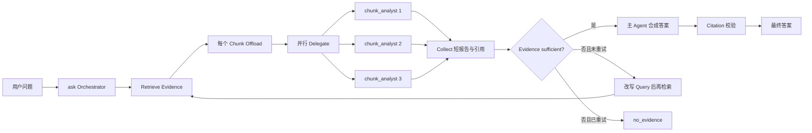

# Paper Agent Retrieve–Offload–Delegate RAG 重构方案

> 状态：Draft for Approval  
> 本文只定义重构方案，不代表已经实现。  
> 参考：[LangChain Deep Agents — Retrieval Augmented Generation](https://docs.langchain.com/oss/python/deepagents/rag)

## 1. 审批摘要

本方案将 `paper-agent ask` 作为唯一的日常问答入口，把 Retrieve、Offload 和
Delegate 组合成一次 RAG 内部的确定性执行链：

```text
用户问题
→ Retrieve 相关 Evidence Chunk
→ 每个 Chunk 单独 Offload 为 Evidence Artifact
→ 每个 Artifact 委派给隔离的 chunk_analyst Worker
→ Worker 并行读取、筛选和摘要
→ 主 Agent 只接收短报告与 Citation Manifest
→ 证据充分性判断
→ 最终答案或带改写查询的第二轮检索
```

用户不再需要为了普通 RAG 问答手动选择 `ask` 或 `delegate`，也不需要提供
`paper_id`、`workstream` 或 `max_workers`。`delegate` CLI 保留为高级研究任务和
调试入口，但不再代表标准 RAG 使用方式。

推荐决策：复用现有 PostgreSQL、Artifact Store、Worker、Redis Checkpoint 和引用
校验组件，不引入 `deepagents` 运行时依赖；按照其上下文工程模式重组当前代码。

## 2. 背景与当前偏差

Deep Agents 文档中的 Retrieve–Offload–Delegate 模式具有四个关键特征：

1. 检索工具把匹配 Chunk 写入文件系统或后端存储，而不是把全文留在 orchestrator
   上下文。
2. 主 Agent 只接收文件路径或紧凑引用。
3. 一个或多个隔离子 Agent 分别读取并分析这些 Chunk。
4. 主 Agent 根据子 Agent 的短报告完成合成。

当前 Paper Agent 已分别实现 Retrieve、Artifact Offload 和 ResearchTask Delegate，
但它们尚未形成上述单一运行链：

- `search_knowledge` 的小结果仍会直接进入主 Agent 上下文。
- Offload 通常以整个 Tool Result 为单位，而不是一个 Evidence Chunk 一个 Artifact。
- Delegate 主要根据论文数量或显式 Workstream 触发。
- `delegate` CLI 需要用户手动提供 Paper ID，并与 `ask` 形成两个用户入口。
- 当前 Scheduler 按拓扑顺序同步运行，尚未并行分析独立 Chunk。
- MiMo 在 Search Evidence 足够时会直接进入最终合成，没有等待 Chunk Worker。

因此，当前实现拥有相关基础设施，但标准 `ask` 尚不能称为完整的
Retrieve–Offload–Delegate RAG。

## 3. 目标与非目标

### 3.1 目标

- 所有需要论文语料证据的 `ask` 默认使用 Retrieve–Offload–Delegate。
- 主 Agent 上下文中不出现检索 Chunk 全文。
- 每个选中的 Evidence Chunk 独立成为一个可追溯 Artifact。
- 每个 Worker 默认只读取一个获授权的 Evidence Artifact。
- 无依赖的 Chunk 分析在有界并发下并行执行。
- 最终答案只能引用 Worker 实际返回且存在于 Citation Manifest 的证据。
- 支持检索不足时最多执行一次查询改写和第二轮检索。
- OpenAI 与 MiMo 使用相同的领域协议和验收标准。
- 用户可通过 `--trace` 看到 RAG 阶段，而不必手工轮询数据库。

### 3.2 非目标

- 本轮不迁移到 LangChain/Deep Agents 框架。
- 本轮不删除 Research Graph、Profile、Compare 或显式 `delegate` 能力。
- 本轮不实现多层递归委派；Worker 仍不能创建 Worker。
- 本轮不允许 Worker 修改 canonical Research Graph。
- 本轮不把 PDF 解析、索引或数据库运维纳入 Delegate。

## 4. 目标用户流程

用户只需执行：

```bash
uv run paper-agent ask \
  --root "$PAPER_AGENT_PROJECT_ROOT" \
  --database-url "$PAPER_AGENT_DATABASE_URL" \
  --redis-url "$PAPER_AGENT_REDIS_URL" \
  --provider mimo \
  --model mimo-v2.5-pro \
  --trace summary \
  "2D-TAN 的主要方法是什么？请给出论文证据。"
```

内部流程：



## 5. 核心设计决策

### 5.1 单一问答入口

`ask` 是普通用户唯一需要理解的 RAG 入口。

- `ask`：问答、检索、Offload、Delegate、Collect、合成。
- `delegate`：保留为高级批量研究、故障复现和人工验收入口。
- `search` / `read`：保留为确定性调试和直接数据访问入口。

### 5.2 使用复合 RAG 工具

在主 Agent 注册新的内部工具 `retrieve_and_analyze_knowledge`。它由
`RetrieveOffloadDelegateService` 实现，并在一次工具执行中完成：

```text
search_knowledge
→ evidence selection
→ per-evidence materialization
→ chunk WorkUnit planning
→ bounded parallel Worker execution
→ compact collection
```

采用复合工具的原因：

- 避免依赖模型严格按顺序调用 Search、Artifact 和 Delegate 工具。
- 避免 MiMo 文本 ToolCall 兼容问题影响流程完整性。
- 保证 Retrieve 成功后一定执行 Offload 和 Delegate。
- 允许在服务层统一控制并发、预算、重试和幂等。

主 Agent 在标准 RAG 模式下不再直接获得 `search_knowledge` 和 `read_paper`。精确读取
能力下沉给 Worker；主 Agent 只接收复合工具的紧凑结果。

### 5.3 一个 Evidence Chunk 对应一个 Artifact

新增 Artifact Type：`retrieved_evidence`。数据库字段为字符串，不需要新增表或修改
列类型。

Evidence Artifact 的建议 Payload：

```json
{
  "query": "用户或改写后的检索问题",
  "citation": "E123",
  "paper_id": "uuid",
  "version_id": "uuid",
  "paper_title": "Paper title",
  "section_id": "uuid",
  "section_path": "3 Method > 3.2 Module",
  "page_start": 3,
  "page_end": 4,
  "chunk_id": "uuid",
  "element_ids": [],
  "text": "完整 Evidence Chunk",
  "retrieval_scores": {
    "dense": 0.0,
    "bm25": 0.0,
    "rerank": 0.0,
    "relevance": 0.0
  }
}
```

主 Agent 只能看到：

```json
{
  "artifact_id": "uuid",
  "paper_title": "Paper title",
  "section_path": "3 Method > 3.2 Module",
  "pages": [3, 4],
  "citation": "E123"
}
```

`text` 只能由获授权的 Worker 通过 `read_artifact` 读取。

### 5.4 专用 chunk_analyst Worker

新增实现型 Worker：`chunk_analyst`。

权限：

- 只允许 `read_artifact`。
- 默认只允许读取一个 Evidence Artifact。
- 不允许 `search_knowledge`、`delegate_research` 或任意文件路径。
- 不接收主对话历史，只接收问题、Artifact ID、输出 Schema 和预算。

输出 Schema：

```json
{
  "relevance": "relevant | partial | irrelevant",
  "summary": "与问题直接相关的简短事实摘要",
  "claims": [
    {
      "text": "可由该 Chunk 支持的事实",
      "citations": ["E123"]
    }
  ],
  "unresolved_questions": []
}
```

Worker 输出继续始终 Offload 为 `worker_result`；主 Agent 只收到摘要、Claim、引用和
Worker ArtifactReference。

### 5.5 有界并行

将当前 Scheduler 扩展为依赖层级并行：

- 同一 DAG 层且无依赖的 WorkUnit 可并行。
- 默认最大并发为 3。
- 每个 Worker 使用独立 Checkpoint 和模型实例/Provider Client。
- 验证或汇总 WorkUnit 必须等待所有前置分析完成。
- 单 WorkUnit 最多重试一次。
- 同一 Evidence Artifact 不重复分析。

### 5.6 主 Agent 上下文契约

最终合成输入只允许包含：

- 原始用户问题。
- Worker 短报告。
- Worker Claim。
- Citation Manifest 中的来源元数据。
- `unresolved_questions` 和失败摘要。

禁止包含：

- 原始检索 Chunk 全文。
- Worker 完整执行历史。
- Dense/BM25/Rerank 的完整调试数据。
- Artifact Blob 正文。
- 其他会话内容。

### 5.7 两轮检索上限

第一轮 Worker 报告经过 Evidence Sufficiency Judge：

- 至少一个 `relevant` 报告且存在合法 Claim/Citation：进入合成。
- 只有 `partial/irrelevant`：生成一次改写 Query，执行第二轮。
- 第二轮仍不足：返回 `no_evidence`，禁止模型用记忆补全论文事实。

默认不超过 2 轮检索，避免不受控循环和 API 成本。

## 6. 复用、替换与降级

### 6.1 直接复用

- `AdvancedSearchKnowledgeService`
- Query Rewrite、Hybrid Search、Reranker、Evidence Judge
- `ArtifactService` 与 Local Content-addressed Blob Store
- `research_artifacts` 与 `artifact_citations`
- `research_tasks` 与 `work_units`
- `WorkerRunner` 的隔离、预算、Schema 和 Citation 验证
- Redis Checkpoint
- `ToolEvidenceCitationFormatter`
- OpenAI/MiMo Provider

### 6.2 新增

- `RetrieveOffloadDelegateService`
- `EvidenceArtifactMaterializer`
- `chunk_analyst`
- 按依赖层并行的 Scheduler 执行方式
- `RodResultCollector`
- RAG Trace Event
- `retrieve_and_analyze_knowledge` Tool Adapter

### 6.3 不再用于标准 ask 主路径

- 由模型自行决定是否调用 `delegate_research`
- 按论文数量触发标准 RAG Delegate
- `paper_analyzer` 的多 Workstream Planner
- 主 Agent 直接调用 `search_artifact/read_artifact`
- 小 Search Result Inline 全文

这些能力仍可供显式 `delegate` 和高级研究流程使用。

## 7. 建议代码结构

新增：

```text
src/paper_agent/rag/
├── domain.py                  # RAG run、EvidenceArtifact、AnalystReport
├── rod_service.py             # Retrieve→Offload→Delegate→Collect
├── evidence_materializer.py   # 每个 Evidence 独立 Artifact
├── planner.py                 # 一个 Artifact 一个 chunk-analysis WorkUnit
├── collector.py               # 报告去重、Citation 合并、充分性判断
└── tracing.py                 # 结构化阶段事件

src/paper_agent/agent/
└── rod_tool_adapter.py        # retrieve_and_analyze_knowledge

src/paper_agent/workers/
└── chunk_analyst.py           # 专用 Worker 定义与输出契约
```

修改：

```text
src/paper_agent/application.py
  构建 ROD Service；标准 ask 注册复合工具。

src/paper_agent/agent/prompts.py
  标准论文事实问题必须调用 retrieve_and_analyze_knowledge。

src/paper_agent/delegation/scheduler.py
  支持同层有界并行，保留依赖顺序和幂等。

src/paper_agent/delegation/registry.py
  注册 chunk_analyst。

src/paper_agent/providers/openai_provider.py
  只在复合工具返回 supported/insufficient 后进入最终合成；
  不在原始 Search 阶段提前 finalize。

src/paper_agent/cli.py
  ask 增加 --rag-mode 与 --trace；delegate 标记为 advanced/debug。
```

## 8. 配置与默认预算

建议配置：

```dotenv
PAPER_AGENT_RAG_MODE='retrieve-offload-delegate'
PAPER_AGENT_RAG_MAX_EVIDENCE='6'
PAPER_AGENT_RAG_MAX_PER_PAPER='2'
PAPER_AGENT_RAG_MAX_WORKERS='3'
PAPER_AGENT_RAG_MAX_ROUNDS='2'
PAPER_AGENT_RAG_WORKER_TOKEN_BUDGET='1200'
PAPER_AGENT_RAG_WORKER_TOOL_CALL_BUDGET='2'
PAPER_AGENT_RAG_WORKER_TIMEOUT_SECONDS='90'
```

CLI：

```text
--rag-mode retrieve-offload-delegate   默认模式
--rag-mode direct                      仅用于回滚和对照评测
--trace none                           默认无过程输出
--trace summary                        向 stderr 输出阶段摘要
--trace jsonl                          向 stderr 输出机器可读事件
```

Trace 不混入 stdout 的最终 JSON。建议事件：

```text
rag.retrieve.started
rag.retrieve.completed
rag.artifact.created
rag.delegate.started
rag.worker.started
rag.worker.completed
rag.collect.completed
rag.sufficiency.checked
rag.synthesis.started
rag.answer.validated
```

## 9. 数据库与 Migration 决策

推荐不新增 Migration：

- `research_tasks.task_type` 和 `work_units.work_type` 已是字符串字段。
- `research_artifacts.artifact_type` 已是字符串字段。
- 现有 provenance 字段足以关联 session、task、work unit 和 tool call。
- Citation Manifest 已有独立表。

建议新增领域枚举值：

```text
ResearchTaskType.RAG_EVIDENCE_ANALYSIS
ArtifactType.RETRIEVED_EVIDENCE
work_type = chunk_analysis
requested_worker = chunk_analyst
```

只有在审批要求持久化逐阶段耗时和 Token 成本时，再增加 `rag_run_events` Migration；
第一版可通过结构化 Trace 和现有 Task/WorkUnit 时间字段完成观测。

## 10. 错误与降级策略

| 情况 | 行为 |
|---|---|
| Retrieve 无候选 | 返回 `no_evidence`，不创建 Worker |
| Artifact 写入失败 | 整次 RAG 失败，不把正文 Inline 回主 Agent |
| 单个 Worker 失败 | 重试一次；仍失败则记录 partial failure |
| 部分 Worker 成功 | 仅使用成功报告；充分性 Judge 决定能否回答 |
| 全部 Worker 失败 | 返回明确错误，不让模型凭记忆回答 |
| Citation 不属于 Manifest | 拒绝 Worker 或最终答案 |
| Worker 越权读取 Artifact | 返回稳定授权错误并记录失败 |
| 第一轮证据不足 | 改写 Query，最多执行第二轮 |
| 第二轮仍不足 | 返回 `no_evidence` |
| MiMo 输出文本 ToolCall | 现有规范化逻辑处理；工具标记不得进入最终答案 |

## 11. 测试方案

### 11.1 单元测试

- 一个 Evidence 对应一个 `retrieved_evidence` Artifact。
- 主 Agent Compact Payload 不包含 Evidence `text`。
- Chunk Analyst 只能读取分配给自己的 Artifact。
- Worker 输出的 Citation 必须属于输入 Artifact Manifest。
- 无依赖 WorkUnit 同层并行，依赖 WorkUnit 后执行。
- 最大并发、Token、ToolCall、超时和重试预算生效。
- 第一轮不足时只允许一次 Query Rewrite。
- 第二轮不足返回 `no_evidence`。
- MiMo/OpenAI 只在 ROD Collect 后 finalization。

### 11.2 PostgreSQL/Redis 集成测试

- Task → WorkUnit → Evidence Artifact → Worker Artifact provenance 完整。
- Checkpoint 不含检索 Chunk 全文。
- 相同请求重放不重复创建 Artifact 或 WorkUnit。
- Worker 中断恢复不重复调用工具。
- Worker Artifact 和 Citation Manifest 可被 Collect 正确读取。

### 11.3 端到端验收

执行一条 `paper-agent ask` 后必须观察到：

```text
1 个 RAG ResearchTask
N 个 retrieved_evidence Artifact
N 个 chunk_analysis WorkUnit
N 个或部分成功的 worker_result Artifact
1 个紧凑 Collect Result
1 个只引用 Manifest 标签的最终答案
```

用户不得需要运行 `paper-agent delegate`。

## 12. 验收标准

以下条件全部满足才算完成：

1. `ask` 是标准 RAG 唯一入口。
2. 每个选中 Chunk 独立 Offload，主 Agent 不接收正文。
3. 每个 Chunk 至少对应一个隔离分析 WorkUnit。
4. 无依赖 Worker 能在最大并发限制内并行执行。
5. 主 Agent 只根据 Worker 报告与 Citation Manifest 回答。
6. 最终引用能够回溯到 Paper、Version、Section、Page 和 Chunk。
7. Evidence 不足时执行至多一次改写检索，之后返回 `no_evidence`。
8. MiMo 与 OpenAI 均通过相同 E2E 测试。
9. `--trace summary/jsonl` 能显示完整 ROD 阶段。
10. 现有 ingest、search、read、profile-extract、compare 和高级 delegate 不回归。

## 13. 实施顺序

### Step 1：建立领域契约

- 新增 RAG Domain、Evidence Artifact 和 Analyst Report。
- 先写失败测试，锁定“主 Agent 不得看正文”和 Citation 边界。

### Step 2：实现 Retrieve + Per-Chunk Offload

- 包装现有 Search Service。
- 对选中 Evidence 去重、限额并逐条 Materialize。
- 返回 ArtifactReference 列表。

### Step 3：实现 Chunk Analyst + 并行调度

- 注册专用 Worker。
- 一个 Artifact 生成一个 WorkUnit。
- Scheduler 支持同层有界并发。

### Step 4：实现 Collect + Sufficiency

- 汇总短报告、Claim、Citation 和失败项。
- 增加最多一次查询改写。

### Step 5：接入 ask 与 Provider

- 注册复合工具。
- 移除标准 ask 中原始 Search/Read/Delegate 工具暴露。
- 修改 MiMo/OpenAI finalization 时机。

### Step 6：Trace、E2E 与文档

- 增加 `--trace`。
- 运行真实 PostgreSQL、Redis、MiMo/OpenAI 集成测试。
- 更新使用说明与开发日志。

## 14. 风险与控制

| 风险 | 控制措施 |
|---|---|
| 每个 Chunk 一个模型调用导致成本上升 | 默认最多 6 个 Evidence、并发 3、每 Worker 1200 Token |
| 并发模型 Client 或数据库 Session 不安全 | Worker 使用独立 Provider Client 和独立 Session |
| 子 Agent 摘要遗漏重要内容 | 保留 Citation Manifest；允许第二轮检索；离线评测召回率 |
| Artifact 数量增长 | 内容寻址去重、30 天保留期、定期过期清理 |
| 简单问题延迟增加 | 保留 `direct` 对照模式；后续基于评测决定是否增加单 Chunk 快速路径 |
| 复杂 Planner 再次进入标准路径 | 标准 RAG 使用固定 chunk-analysis 计划，不使用通用 Workstream Planner |

## 15. 请求审批的决策项

请逐项批准或提出修改：

- [ ] 标准论文 RAG 只保留 `ask` 作为用户入口。
- [ ] `delegate` CLI 保留，但定位为高级研究和调试工具。
- [ ] 标准 RAG 使用确定性的 `retrieve_and_analyze_knowledge` 复合工具。
- [ ] 每个选中 Evidence Chunk 独立 Offload 为 Artifact。
- [ ] 每个 Evidence Artifact 分配给一个 `chunk_analyst`。
- [ ] 默认最大 Evidence 6、每篇最多 2、并发 Worker 3。
- [ ] 检索最多 2 轮，第二轮不足即 `no_evidence`。
- [ ] 复用现有 Task/WorkUnit/Artifact 表，第一版不新增 Migration。
- [ ] `retrieve-offload-delegate` 成为 `ask` 默认 RAG 模式。
- [ ] 保留 `direct` 模式仅用于回滚和对照测试。
- [ ] 增加 `--trace summary/jsonl` 观察内部过程。
- [ ] 不引入 Deep Agents 依赖，只复用其架构模式。

审批通过后，按第 13 节顺序实施；任何改变上述数据边界、调用成本上限或用户入口的
实现调整，需要重新提交审批。
